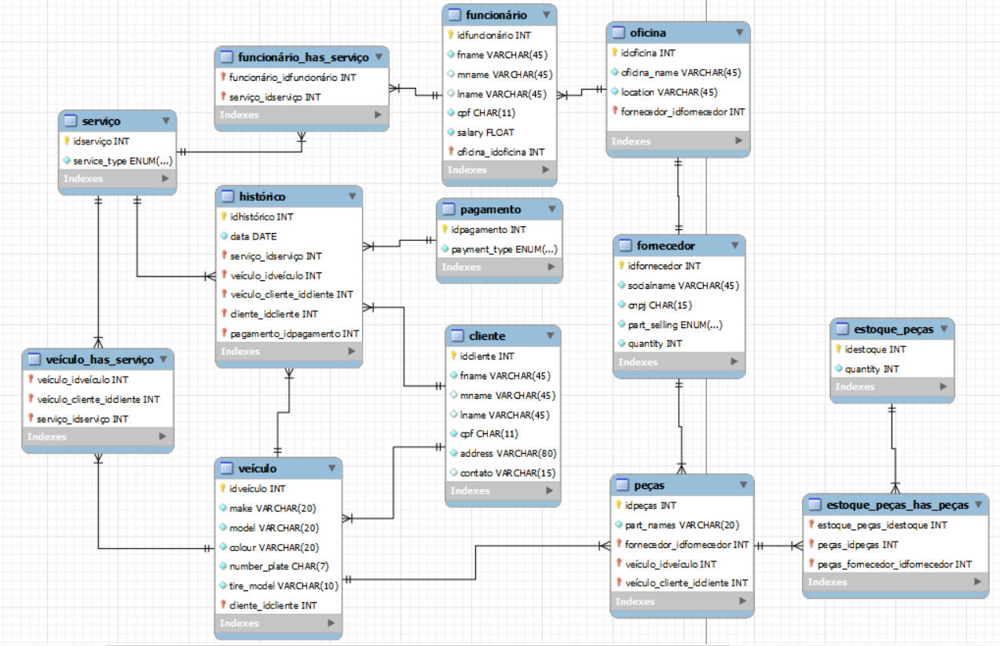

# Database de Oficina Automotiva

Este é um exemplo de banco de dados para uma oficina automotiva, projetado para armazenar informações sobre clientes, veículos, serviços, mecânicos, peças, fornecedores e histórico de serviços realizados.

## Tabelas no arquivo sql

1. **clients:** Armazena informações sobre os clientes da oficina.
2. **vehicle:** Contém detalhes sobre os veículos associados aos clientes.
3. **mechanic_local:** Registra o local de trabalho dos mecânicos.
4. **worker:** Mantém informações sobre os trabalhadores da oficina.
5. **services:** Lista os tipos de serviços disponíveis.
6. **historys:** Registra o histórico de serviços realizados, associando clientes, veículos, e serviços.
7. **payment:** Armazena informações sobre os pagamentos associados aos serviços realizados.
8. **parts:** Contém detalhes sobre as peças disponíveis.
9. **parts_storage:** Registra o estoque de peças disponíveis na oficina.
10. **supplier:** Armazena informações sobre os fornecedores de peças.

## Como Utilizar o Database

### Pré-requisitos

- Certifique-se de ter um ambiente MySQL configurado e pronto para uso.

### Utilizando os arquivos

1. Faça o download dos arquivos localizados na pasta "arquivos_sql" ou clone este repositório em sua maquina.
2. Se estiver com o ambiente MySQL configurado e pronto para ser utilizado, siga as seguintes etapas:
   - execute o arquivo oficina.sql e de run em todas tas linhas para criar as tabelas;
   - depois execute o arquivo oficina_data.sql e novamente de run em todas as linhas para preencher o banco com os dados;
   - lembre-se de apagar as queries já existentes para caso você queira realizar as suas próprias queries.

## Notas

- Os dados utilizados são fictícios, nenhuma dessas pessoas ou datas são reais.
- Meu segundo banco de dados criado, qualquer ponto de melhoria ou feedback são bem vindo.
